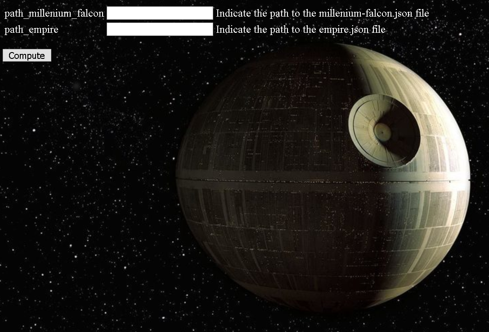

# What are the odds ?

## Libraries
This code has been written in Python 3.7.2
In order to run this code, the following packages must be installed:
* flask
* sqlite3
* json
* wtforms
* PIL

## How to run this web application ?

To run this web application, the following command must be run:
`python controller.py`

Then you have to connect to your local serer : **http://127.0.0.1:5000/**

You will see the following page:

* In the first text field, you must write the path to the *millenium-falcon.json* file (for example: C:/Users/Mathieu Pichon/inputs/millenium-falcon.json)

* In the second text field, you must write the path to the *empire.json* file (for example: C:/Users/Mathieu Pichon/inputs/empire.json)

* Then you click on the button *Compute*. The probability the millenium falcon will reach Endor without being captured will be displayed.

## Knowing issues

A frequent Error is the following *OSError: cannot open resource*.
This can be caused by the script **display_prob.py**. In this script, we use the arial font *font = ImageFont.truetype("arial.ttf", fontsize)*. This font might not be installed on your computer, thus you will need to change this font.
